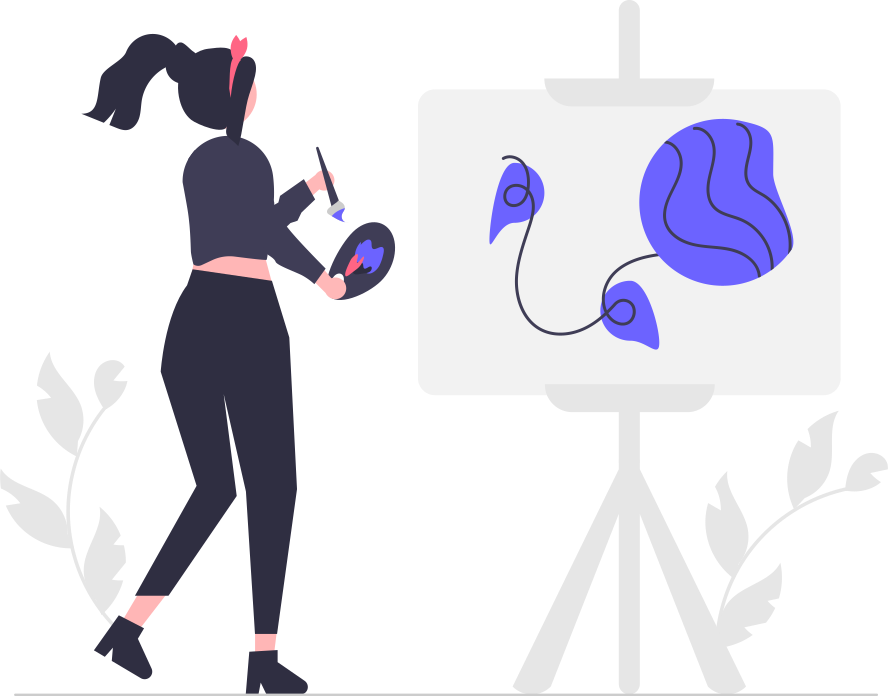

# AirDraw - Hand Gesture Drawing Application



A computer vision-based drawing application that allows users to create digital art using hand gestures in the air.

## Features

- **Hand Gesture Recognition**: Draw by pinching your index finger and thumb together
- **Gesture Control**: Start and stop drawing naturally without requiring any physical input device
- **Adjustable Friction**: Control how much smoothing is applied to your movements
- **Multiple Color Palette**: 8 predefined colors with easy switching
- **Adjustable Brush Size**: Change the thickness of your drawing lines
- **Fullscreen Support**: Maximize your drawing area for detailed work
- **Save Functionality**: Export your creations as PNG images
- **Real-time Visual Feedback**: See exactly when the system is detecting your drawing gestures

## Demo


## Requirements

- Python 3.7+
- Webcam
- Libraries:
  - OpenCV (4.5+)
  - NumPy
  - MediaPipe
  - X11/XCB display environment (Linux/Mac)

## Installation

1. Clone this repository:
   ```bash
   git clone https://github.com/yourusername/airdraw.git
   cd airdraw
   ```

2. Create a virtual environment (recommended):
   ```bash
   python -m venv venv
   source venv/bin/activate  # On Windows: venv\Scripts\activate
   ```

3. Install the required packages:
   ```bash
   pip install -r requirements.txt
   ```
   
   Alternatively, install dependencies manually:
   ```bash
   pip install opencv-python numpy mediapipe
   ```

## Usage

1. Start the application:
   ```bash
   python airdraw.py
   ```

2. Three windows will appear:
   - **Tracking**: Shows your webcam feed with hand tracking
   - **Paint**: The canvas where your drawing will appear
   - **Controls**: Sliders for adjusting brush size and smoothing

3. To draw:
   - Make a pinch gesture by bringing your index finger and thumb together
   - Move your hand while maintaining the pinch to draw
   - Release the pinch to stop drawing

## Controls

### Hand Gestures

| Gesture | Action |
|---------|--------|
| Pinch (index+thumb) | Start drawing |
| Release pinch | Stop drawing |
| Pinch over color button | Select that color |
| Pinch over "CLEAR ALL" | Erase entire canvas |

### Keyboard Shortcuts

| Key | Action |
|-----|--------|
| `s` | Save the current drawing |
| `c` | Clear the canvas |
| `f` | Toggle fullscreen mode |
| `r` | Reset calibration |
| `q` | Quit the application |

### Customization

Use the sliders in the Controls window to adjust:
- **Brush Size**: Changes the thickness of the drawing lines (1-15)
- **Smoothing**: Controls how much "friction" is applied to the drawing (0-10)
  - Higher values = smoother lines but more lag
  - Lower values = more responsive but potentially shakier lines

## How It Works

AirDraw uses MediaPipe's hand tracking capabilities to detect hand landmarks in real-time from your webcam feed. The application specifically tracks the positions of your index finger and thumb:

1. The index fingertip serves as the pointer/cursor
2. The distance between your index fingertip and thumb tip determines if you're in "drawing mode"
3. When the distance falls below a threshold, the application interprets this as a pinch gesture and begins drawing
4. To reduce shakiness and provide better control, a smoothing algorithm applies "friction" to your movements

The drawing is simultaneously displayed on both the webcam feed (for immediate feedback) and the larger canvas window (for a cleaner view of your creation).

## Troubleshooting

### Common Issues

1. **MediaPipe not installing correctly**
   ```bash
   pip install --upgrade pip
   pip install mediapipe --no-cache-dir
   ```

2. **Webcam not detected**
   - Make sure your webcam is properly connected
   - Try a different USB port
   - Make sure no other application is using the webcam

3. **X11/XCB Environment Issues (Linux)**
   - Make sure you have X11 installed: `sudo apt-get install libx11-dev`
   - Set the environment variables:
     ```bash
     export QT_QPA_PLATFORM=xcb
     export XDG_SESSION_TYPE=x11
     ```

4. **Poor Hand Detection**
   - Ensure your room has adequate lighting
   - Keep your hand within the camera's field of view
   - Maintain some distance from the camera for better tracking

## Performance Optimization

For better performance, especially on lower-end systems:

1. Reduce your webcam's resolution in the code (e.g., cap.set(cv2.CAP_PROP_FRAME_WIDTH, 640))
2. Lower the MediaPipe hand detection confidence threshold for faster detection
3. Increase the smoothing value to reduce the frequency of drawing updates

## Contributing

Contributions are welcome! Here's how you can contribute:

1. Fork the repository
2. Create a new branch (`git checkout -b feature/your-feature`)
3. Make your changes
4. Commit your changes (`git commit -m 'Add some feature'`)
5. Push to the branch (`git push origin feature/your-feature`)
6. Open a Pull Request

### Feature Ideas

- [ ] Multi-hand support for collaborative drawing
- [ ] Additional drawing tools (circles, rectangles, lines)
- [ ] Color picker from webcam feed
- [ ] Undo/redo functionality
- [ ] Layer support
- [ ] Export to multiple formats
- [ ] Different brush styles

## License

This project is licensed under the MIT License - see the [LICENSE](LICENSE) file for details.

## Acknowledgments

- [MediaPipe](https://google.github.io/mediapipe/) for the hand tracking solution
- [OpenCV](https://opencv.org/) for computer vision capabilities
- [NumPy](https://numpy.org/) for numerical operations

---

Created by [Your Name] - [Your Website/GitHub]

If you find this project useful, please consider giving it a star ⭐
